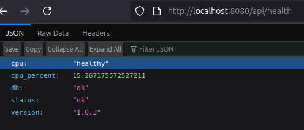

# Full Stack Microservice: Go + ArchitectUI React + Nginx (Dockerized)

This project sets up a microservice backend using Go and `gin`, serving a React-based ArchitectUI frontend via Nginx — all containerized with Docker.


## Project Structure

```
project-root/
├── backend/ # Go backend using gin
│ ├── main.go
│ ├── go.mod
│ ├── go.sum
│ ├── main.go              # Entry point
│ ├─ config/               # Environment + app config
│ │ └── config.go
│ ├─ routes/               # API route definitions
│ │ └── health.go
│ ├─ handlers/             # Actual handler logic
│ │ └── health.go
│ └─ utils/                # Helper functions
│   └── status.go
├── frontend/ # React frontend (ArchitectUI)
│ ├── [React source files...]
│ └── build/ # created by npm run build
├── nginx/
│ └── default.conf # Nginx config for serving frontend and proxying API
├── Dockerfile # Fullstack Dockerfile
├── docker-compose_dev.yml # For local orchestration
└── docker-compose.yml # For production
```

---

## Prerequisites

- [Go 1.21+](https://golang.org/dl/)
- [Node.js 18+](https://nodejs.org/)
- [Docker](https://www.docker.com/)

---

## Setup Go Backend

Initialize the Go module:

```bash
# Optional: make sure Go is in your PATH
export PATH=$PATH:/usr/local/go/bin

cd backend
go mod init backend
go get github.com/gin-gonic/gin
go get github.com/shirou/gopsutil/v3
go mod tidy
```

## Setup React Frontend

Use the ArchitectUI React theme.

```bash
cd frontend
curl -L -o master.zip https://github.com/DashboardPack/architectui-react-theme-free/archive/refs/heads/master.zip
unzip master.zip && mv architectui-react-theme-free-master/* . && rm -rf architectui-react-theme-free-master master.zip
```
Edit package.json and add axios as a dependency (if not already installed):

```json
{
  "dependencies": {
    "axios": "^1.6.0"
  }
}
```

Then install all dependencies and build:
```bash
npm install
npm run build
```


## Example API Call in React
src/api.js
```js
import axios from 'axios';

const api = axios.create({
  baseURL: '/api', // Nginx will proxy /api to the Go backend
  timeout: 5000,
});

export default api;
```

Use it in any component:
```jsx
import { useEffect, useState } from 'react';
import api from './api';

function HealthCheck() {
  const [status, setStatus] = useState('');

  useEffect(() => {
    api.get('/health')
      .then(res => setStatus(res.data.status))
      .catch(() => setStatus('error'));
  }, []);

  return <div>Backend Status: {status}</div>;
}
```



** Optional HealthCheckCard React component using ArchitectUI layout and styling
src/components/HealthCheckCard.js

```jsx
import React, { useEffect, useState } from 'react';
import api from '../api'; // Make sure this file exports an axios instance with baseURL '/api'

const HealthCheckCard = () => {
  const [status, setStatus] = useState('checking...');

  useEffect(() => {
    api.get('/health')
      .then(res => setStatus(res.data.status || 'unknown'))
      .catch(() => setStatus('error'));
  }, []);

  const getStatusColor = () => {
    switch (status) {
      case 'ok':
        return 'success';
      case 'error':
        return 'danger';
      default:
        return 'warning';
    }
  };

  return (
    <div className="col-md-4">
      <div className={`card border-${getStatusColor()} mb-3`}>
        <div className={`card-header bg-${getStatusColor()} text-white`}>
          Backend Health
        </div>
        <div className="card-body">
          <h5 className="card-title">Status: <span className={`text-${getStatusColor()}`}>{status}</span></h5>
          <p className="card-text">This card reflects the live health check result from your Go microservice.</p>
        </div>
      </div>
    </div>
  );
};

export default HealthCheckCard;
```

Import the card into your dashboard or layout:
```jsx
import HealthCheckCard from './components/HealthCheckCard';

function DashboardExample() {
  return (
    <div className="row">
      <HealthCheckCard />
    </div>
  );
}
```

## Running the Project

```bash
docker-compose up --build
```
Open: http://localhost  (will serve frontend/build/index.html)


## API Test

Check the health endpoint:
```bash
curl http://localhost/api/health
```
Expected:  {"status":"ok"}


## Live-Reloading for Go (Dev Mode)
Add `air` to the project

```bash
go install github.com/air-verse/air@latest
export PATH=$PATH:$HOME/go/bin
cd backend
air init
```
This creates .air.toml — you can customize watch dirs, ignored files, build cmd, etc.

Then use a dev-specific Docker Compose file (you create it, e.g. docker-compose.dev.yml) to mount volumes and skip building each time:

```bash
docker-compose -f docker-compose.dev.yml up --build
```

Helpful Docker commands to remember:
```bash
docker ps -a
docker exec -it <CONTAINER_ID> sh
docker-compose -f docker-compose.dev.yml down
```

## Required GitHub Secrets

| Secret Name     | Description                                                            |
| --------------- | ---------------------------------------------------------------------- |
| `GHCR_USERNAME` | Your GitHub username                                                   |
| `GHCR_TOKEN`    | GitHub personal access token with `write:packages` and `read:packages` |
| `IMAGE_NAME`    | Docker image name, e.g. `ghcr.io/youruser/your-repo`                   |
| `DEPLOY_SERVER` | Public IP or DNS of your production server                             |
| `DEPLOY_USER`   | SSH username on the server (e.g. `ubuntu`, `root`)                     |
| `DEPLOY_KEY`    | Private SSH key with access to the server (no passphrase recommended)  |


** Optional Enhancements (not required for basic CI/CD)

    Self-Hosted Runner:
    Run GitHub Actions directly on your server. This avoids pushing to a registry and speeds up deployments.
    Useful for internal-only services or highly secure environments.

    Zero-Downtime Deploy:
    Prevent service interruptions by using techniques like blue/green deployments or reverse proxy health checks with Nginx.

    Watchtower:
    Automatically pulls updated Docker images and restarts containers on your server.
    Combine with :latest tags for hands-free deployments.